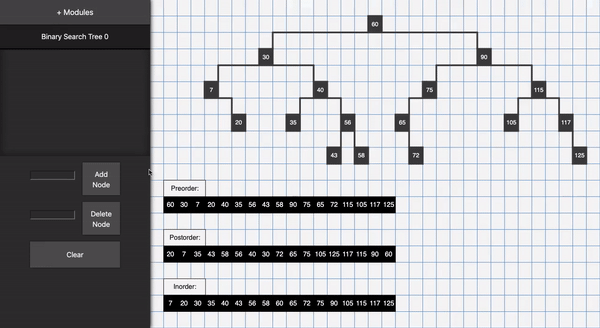

# Binary Search Tree Visualizer

View at: https://priyyanshi.github.io/Data-structures-and-algos/

A React application to visualize binary search tree node insertions and deletions. Depth first traversals for each binary search tree are also provided.

# Demo

## Process:

 Through the project I was able to learn:
* To create p5.js sketches in React applications. 
* Create customized binary search tree traversal algorithms to best suit display purposes.

